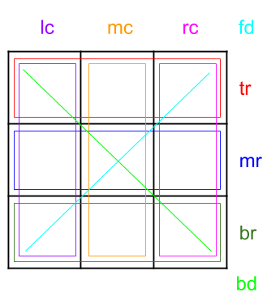
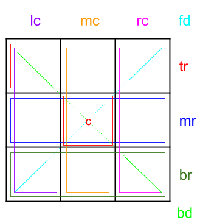

# amphtml-tictactoe

Tic-tac-toe using Accelerated Mobile Pages

Inspired by the [talk given by William Chou](https://youtu.be/xzCFU8b5fCU) on
`amp-bind`, I decided it might be fun to try to write an interactive page using
AMP.

I figured that something like **tic-tac-toe** might be fun, and as a strategic game,
it is about at my intellectual level. I decided also to rename it **imp-⚡-omp**
(it’s all about marketing you know...).

[The result can be played on ampproject.org](https://www.ampproject.org/tictactoe), as it has been adopted as their 404 page. (That's another story).

### Recap on `amp-state` and `amp-bind`

As a recap, these are the kinds of cool things you can do:

**Define some initial state:**

```
<amp-state id="g">
    <script type="application/json">
    {
        "name": "value",
        "settings": {
            "theme": "xyz"
        }
    }
    </script>
</amp-state>
```

**Have elements depend on evaluated expressions, using that state:**

```
<p [text]="'Hello  + g.name" [class]="g.settings.theme == 'xyz' ? 'style-a' : 'style-b'""></p>
```

**Respond to actions to update state, e.g. a button press:**

```
<button on='tap:AMP.setState({
    "g": {
        "name": "newValue"
    }
})'>Update</button>
```

### Approach 1

My initial plan was to use a 2D array as part of my amp-state set up, as follows:

```
<amp-state id="g">
    <script type="application/json">
    {
      board: [
        [" ", " ", " "],
        [" ", " ", " "],
        [" ", " ", " "]
      }
    }
    </script>
</amp-state>
```

Where each click on a tile occurred, I would use `AMP.setState`, combined with the
 [incomplete-but-adequate array manipulation functions](https://www.ampproject.org/docs/reference/components/amp-bind#white-listed-functions)
 to update the array.

Each tile of the board would then be able to simply evaluate the cell of the 2D
array to determine what to display e.g:

```
<td [text]=’g.board[0][0]’></td>
```

Except... that this didn’t work. The issue arose when trying to determine
whether a winning sequence had been input. With each new click, I would need to
check to see whether the player had won. This would involve, for example, for
the backward diagonal, something like:

```
g.board.reduce((a, c, i) => {return g.board[i][i];}, “”)
```

To concatenate the values on the diagonal together. Annoyingly, although `reduce` is supported,
it doesn’t appear to be supported with an initial value option.

But that was the least of my worries. This turned out to be my first encounter
with **the 50 operand limit**.

As it transpires, there is a 50 operand limit for each evaluation that AMP
performs in setting state through `AMP.setState` or evaluating state through the
`[ ]` attributes. And it is surprisingly easy to exceed this limit, at which
point AMP will politely tell you on the console.

One aspect of this I did appreciate however, was it would at least tell you how
many operands you were over by! On a few occasions, where I was over by just a
handful, this was just the incentive to rejig the logic to cut it down and
scrape under the bar…

### Approach 2

This first approach was binned. It became clear it wasn’t going to work given
the constraints involved. Something simpler was required.

To cut the number of operations being performed per click right down, my second
approach experimented with assigning each value of a fresh board a value, doubling from top left to bottom right, e.g. 1,2,4,8... Up to 256.


In this way, keeping two separate scores, one for the **O**, and one for the **⚡**,
any combination of plays by each player could be identified by a single integer.

This would have been really nice it AMP allowed bitwise operators, as it would
have been possible to compare the current score against the list of known winning
combinations, and easily identify when a win had resulted.

Sadly, AMP does not allow bitwise operators. Therefore, I would be left having
to form a lookup table, which I could store in the initial `amp-state` of page,
with all possible winning combinations. There are quite a few.

These possible combinations all add up, and it felt a bit much to have a massive
lookup in the initial `amp-state`, even if it did end up falling within limits.

### Approach 3

So, approach 3 tried to keep things relatively simple, but avoid any cumbersome lookups.
The idea was to have 8 counts: 6 for each row and column and 2 for each diagonal.



When the first player took a turn, the appropriate counts would be incremented,
e.g. if they played top-left, then the following counts would be incremented:

*   Top row
*   Left column
*   Backwards diagonal

When the other player took their turn, the appropriate counts would be
decremented. Thus, any count reaching either 3 or -3 would indicate a win.

To move play to the next player, a variable would store the amount to increment
by each turn, which would start at 1. Each turn it would be multiplied by -1,
therefore forming the sequence 1, -1, 1, -1 … allowing the increment and
decrement described above to work.

An example state update is shown below, for a click in the top left cell:

```javascript
{
    tr: tr + g.p,
    lc: lc + g.p,
    bd: bd + g.p,
    b: {
        a: g[g.p]
    },
    g: {
        p: g.p * -1
    }
}
```

That’s entirely obvious then... To break it down a little, the first three
properties (`tr`, `lc`, `bd`) are updating the count for the top row, left column
and backward diagonal, by adding the value in `g.p`. `g.p` will either be 1 or -1
depending on whose turn it is.

Next, `b`, which stands for board, is updated. `b` has 9 properties, from `a` to `i`,
 where `a` is the top left. This is simply assigned the value of either “O” or “⚡”
 based on the lookup value of `g.p`.

Finally, `g.p` is stepped onward, to transfer play to the next player.

You may ask why the counts exist in the global state, whereas the board values
are all within a sub-object `b`, and why the turn indicator is within the
property `g`? Good questions!

*   Referencing a sub-property, e.g. calling `g.tr`, as opposed to just `tr`
    requires more operators, and it was not possible to take this approach
    without going over the limit of 50.
*   Equally, having the board values `a` to `i` in the global variable resulted
    in too many operations when wanting to reset the board, which instead can be
    done simply by assigning `b` to be `null`.
*   Finally, unlike the other values which can be undefined, `p` needs an initial
    value of 1. Therefore it must be defined in the `amp-state` block towards
    the beginning of the page, under the id `g`.

### 8 becomes 9...

So far so good, all working until the implementation for the centre square is
encountered. Arguably [the most important square of all](https://www.youtube.com/watch?v=F7qOV8xonfY),
there are four counters requiring update here, unlike the 2 or 3 for all other squares.

And as it turns out, trying to update 4 counters tips the number of operations
over 50... Back to the drawing board.

To solve this challenge, the 8 counters are split into 9, with a new counter
created especially for the central tile. This means that clicks on the central
tile require only one counter to be updated, not 4, but the downside, is that
further evaluation (e.g. adding the value of the central counter to that of the
middle row, middle column or either diagonal) will be required for any element
trying to determine whether to show a win or not.



### Detecting victory

With these problems solved, detecting victory is just a case of determining
whether any of the 8 (now 9) counters has reached a positive or negative value 3, e.g:

```
<p [class]="max(tr,br,lc,rc,fd + c,bd + c,mc + c,mr + c) == 3 ? 'show' : 'hide'" class='hide'>⚡ wins!!!</p>
```

### Preventing further clicks

As some tiding up, it is also important that once a tile has been clicked, it
can’t be clicked by the other player! Equally, the tile cannot be clicked if the
game has already been won.

To evaluate both of these scenarios, a simple check of the board, and a check
for positive or negative counts of 3 can be performed, for example for the top-left tile:

```
[disabled]='b.a || max(abs(tr),abs(br),abs(lc),abs(rc),abs(fd + c),abs(bd + c),abs(mc + c),abs(mr + c)) == 3'
```

### Conclusion

All this jiggery pokery results in a working game of tic-tac-toe, I mean imp-⚡-omp. My conclusions would be:

*   `amp-bind` and `amp-state` are pretty good for introducing interactivity into your pages.
*   The 50 operand limit was the unexpected challenge, and you’ll likely need to keep an eye on it.
*   AMP is probably not best for games
*   Imp-⚡-omp is a terrible game

If you [have to play](https://www.ampproject.org/tictactoe), put ⚡ in the centre square.
